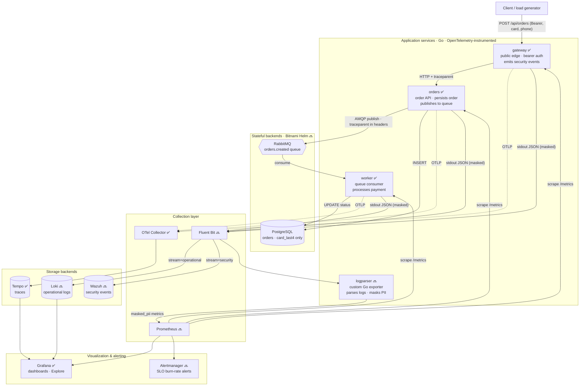
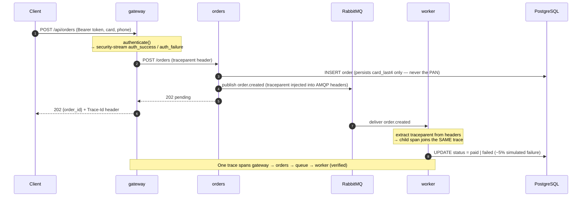
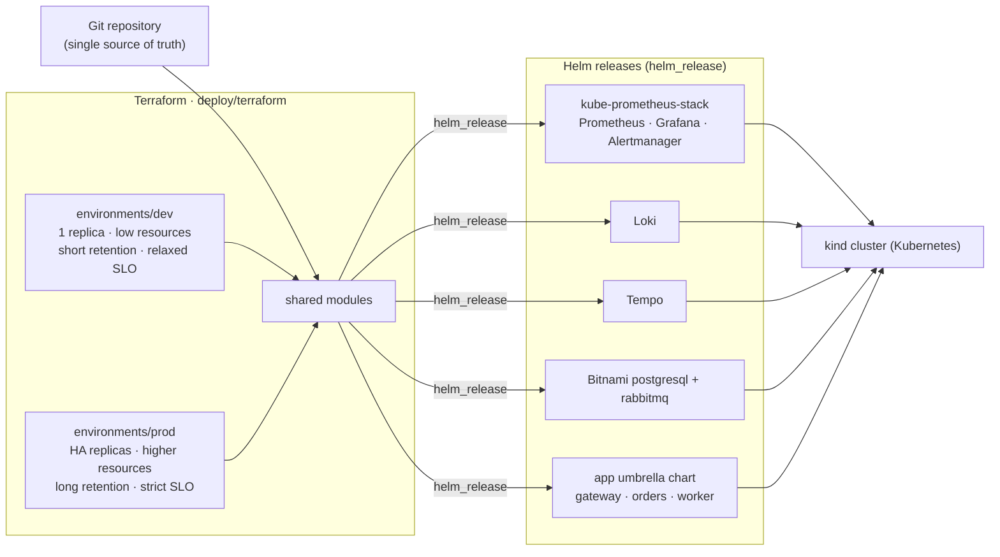

# Observability Lab

An **end-to-end Kubernetes observability laboratory**. A set of small Go APIs
backed by RabbitMQ and PostgreSQL, fully instrumented across the three pillars
of observability — **metrics, traces, and logs** — deployed with **Terraform +
Helm**, with **SLO burn-rate alerting**, **security-event routing to Wazuh**,
and **provable PII masking** so tokens, phone numbers, IDs and account data can
never appear unmasked.

The lab is built **phase by phase**; the authoritative, living plan and status
board is [docs/PLAN.md](docs/PLAN.md).

---

## Table of contents

1. [What this demonstrates](#what-this-demonstrates)
2. [Architecture](#architecture)
3. [Request & trace flow](#request--trace-flow)
4. [Deployment model](#deployment-model)
5. [Component inventory](#component-inventory)
6. [Telemetry planes](#telemetry-planes)
7. [Data model & PII masking](#data-model--pii-masking)
8. [SLOs & alerting](#slos--alerting-design)
9. [Repository layout](#repository-layout)
10. [Getting started](#getting-started)
11. [Verification](#verification)
12. [Ports reference](#ports-reference)
13. [Phase roadmap](#phase-roadmap)

---

## What this demonstrates

This lab is built to satisfy a specific, unusually broad set of requirements.
Each maps to concrete, verifiable code:

| Requirement | How it is met | Where |
|---|---|---|
| K8s cluster with several APIs, a queue, PostgreSQL, Prometheus, Grafana, Loki, Alertmanager | gateway/orders/worker + RabbitMQ + PostgreSQL + kube-prometheus-stack + Loki | `services/`, `deploy/` |
| Terraform + Helm, **separate dev & prod** values, all in Git | Terraform root calls Helm releases; `environments/{dev,prod}` | `deploy/terraform/`, `deploy/helm/` |
| OpenTelemetry tracing across **≥2 services**, propagated over **HTTP _and_ a queue** | `pkg/telemetry`, `otelhttp`, W3C `traceparent` injected into AMQP headers | `pkg/telemetry`, `services/*` |
| **SLOs & burn-rate alerts** for transaction success + latency (not just infra) | Recording rules + multi-window multi-burn-rate alerts on `transactions_total` / `transaction_duration_seconds` | `deploy/` (Phase 10) |
| **Fluent Bit + Wazuh**; operational logs → Loki, auth/security → Wazuh | `stream` field on every log line drives routing | `pkg/logging`, `deploy/` (Phase 7–8) |
| **Data masking + RBAC**; no unmasked tokens/phones/IDs/accounts | `pkg/masking` (unit-proven) + masking slog handler + K8s/Grafana RBAC | `pkg/masking`, `pkg/logging` |
| **One custom Go log parser/exporter** | `logparser` service parses logs, masks PII, exports Prometheus metrics | `services/logparser` (Phase 9) |

> Legend used below: ✅ built & verified · 🔜 planned in a later phase (see PLAN).

---

## Architecture

The system has one **request path** and four **telemetry planes** (metrics,
traces, operational logs, security logs). Every service emits all planes.



Solid arrows are the business/data path; dotted arrows are OTLP traces; the
`Prometheus → service` arrows are metric scrapes.

---

## Request & trace flow

A single distributed trace follows one order from the edge, **through HTTP and
then across the RabbitMQ queue**, into the worker — the core tracing requirement.



Trace context is carried by the W3C `traceparent`: `otelhttp` propagates it over
HTTP, and `pkg/amqp.HeaderCarrier` injects/extracts it through the queue.

---

## Deployment model

Everything is declarative and lives in Git. Terraform drives Helm, with a clean
**dev vs prod** split via per-environment values.



- **Images**: one multi-stage `Dockerfile` (`--build-arg SERVICE=`) → distroless,
  non-root, static ~7 MB images; `make images` then `make kind-load`.
- **dev vs prod** differ only in values (replica counts, resource requests/limits,
  storage retention, alert thresholds) — the same charts and images everywhere.

---

## Component inventory

| Component | Tech | Purpose | Status | In-cluster / local |
|---|---|---|---|---|
| `gateway` | Go | Public edge API, bearer auth, emits security events, forwards to orders | ✅ | both |
| `orders` | Go | Order API; persists order (card last-4 only); publishes to queue | ✅ | both |
| `worker` | Go | Consumes queue, simulates payment, updates status | ✅ | both |
| `logparser` | Go | Custom exporter: parse logs, mask PII, export metrics | 🔜 P9 | — |
| PostgreSQL | Bitnami chart | Order storage | 🔜 P5 (local now) | both |
| RabbitMQ | Bitnami chart | `orders.created` work queue | 🔜 P5 (local now) | both |
| OTel Collector | otel-collector-contrib | Receive OTLP, export to Tempo | ✅ | local (P5 in-cluster) |
| Tempo | Grafana Tempo | Trace storage & query | ✅ | local (P5 in-cluster) |
| Prometheus | kube-prometheus-stack | Metrics scrape & storage, recording/alert rules | 🔜 P5/P6 | in-cluster |
| Alertmanager | kube-prometheus-stack | SLO burn-rate alert routing | 🔜 P5/P10 | in-cluster |
| Grafana | kube-prometheus-stack | Dashboards, Explore, RBAC | ✅ local / 🔜 P5 | both |
| Loki | Grafana Loki | Operational log storage | 🔜 P7 | in-cluster |
| Fluent Bit | Fluent Bit | Log shipping, routing by `stream` | 🔜 P7 | in-cluster |
| Wazuh | Wazuh | Security/auth event SIEM | 🔜 P8 | in-cluster |

---

## Telemetry planes

Every service emits **all** of the following:

- **Metrics** — Prometheus RED signals (`http_requests_total`,
  `http_request_duration_seconds`) plus **transaction-level** signals
  (`transactions_total{type,outcome}`, `transaction_duration_seconds{type}`,
  `queue_published_total`, `queue_consumed_total`). Transaction metrics are the
  raw material for the SLOs — success and latency of the _order_, not just CPU.
- **Traces** — OpenTelemetry via OTLP → Collector → Tempo, propagated across HTTP
  and the queue. Viewable in Grafana → Explore → Tempo.
- **Operational logs** — structured JSON (`slog`), **masked**, tagged
  `stream=operational`, routed to Loki.
- **Security logs** — auth/security events tagged `stream=security`, routed to
  Wazuh. The `stream` field is the single routing key Fluent Bit switches on.

---

## Data model & PII masking

Sensitive data is redacted **before it ever leaves a service**, and the
database stores only non-sensitive derivatives.

- `pkg/masking` — dependency-free redactor for JWTs, bearer/API tokens, opaque
  secrets, payment cards (keeps last 4), IBANs, emails, SSNs, phone numbers,
  national IDs and account numbers. **Unit-proven** that none survive unmasked.
- `pkg/logging` — an `slog` handler that masks the message and every string
  attribute (skipping structural keys like `trace_id`/`service` so correlation
  still works), and stamps the `stream` classification.
- **Storage**: `orders` persists `card_last4` only — the full PAN is never
  written to PostgreSQL.

Prove it locally:

```bash
go test ./pkg/masking/ -v      # 17 cases: nothing sensitive survives
go test ./pkg/logging/ -v      # PII masked in emitted JSON; trace_id preserved
```

Example masked log line (as emitted):

```json
{"level":"INFO","msg":"creating order","service":"orders",
 "customer_id":"cust-123","card_number":"************1111",
 "phone":"*********678","stream":"operational"}
```

---

## SLOs & alerting (design)

Rather than only infrastructure dashboards, the lab defines **transaction
objectives** (Phase 10):

- **Order success rate SLO** — e.g. 99.5% of `checkout` transactions succeed,
  measured from `transactions_total{type="checkout",outcome=...}`.
- **Latency SLO** — e.g. 95% of orders complete under 1s, from
  `transaction_duration_seconds`.

These are enforced with **multi-window, multi-burn-rate** alerts (fast + slow
windows) so a fast error budget burn pages immediately while a slow burn warns —
the standard Google SRE pattern. Thresholds differ per environment (stricter in
prod).

---

## Repository layout

```
services/            Go microservices
  gateway/           public edge API (auth, forwarding, security events)
  orders/            order API (persist + publish)
  worker/            queue consumer (payment processing)
  logparser/         custom Go log parser/exporter (Phase 9)
pkg/                 shared libraries
  masking/           PII/secret redaction (unit-proven)
  logging/           masked structured logging + stream classification
  telemetry/         OpenTelemetry setup (OTLP exporter, W3C propagators)
  metrics/           Prometheus RED + transaction instruments
  httpmw/            HTTP middleware (trace, recover, observe)
  amqp/              RabbitMQ helper + trace HeaderCarrier
  postgres/          pgx pool + schema (advisory-locked)
  config/            12-factor env configuration
deploy/
  terraform/         TF root, shared modules, environments/{dev,prod}
  helm/              app umbrella chart + values/{dev,prod}
  local/             docker-compose dev stack + collector/tempo/grafana config
k8s/                 kind cluster config
scripts/             smoke.sh end-to-end verifier
docs/                PLAN.md (phase tracker), architecture notes
Dockerfile           one multi-stage build for all services
Makefile             build / test / image / kind targets
```

---

## Getting started

### Prerequisites

- Docker · Go 1.26
- `kind`, `kubectl` (installed to `~/.local/bin` — ensure it's on `PATH`)
- `helm`, `terraform` (installed in Phase 5)

### Local stack (fast iteration)

Runs the dependencies (PostgreSQL, RabbitMQ) plus the tracing backends (OTel
Collector, Tempo, Grafana); the Go services run on the host.

```bash
docker compose -f deploy/local/docker-compose.dev.yml up -d
bash scripts/smoke.sh          # drives a full order + asserts trace + masking
# Grafana → Explore → Tempo:  http://localhost:3000
```

### kind cluster

```bash
export PATH="$HOME/.local/bin:$PATH"
make kind-up                   # 3-node cluster (control-plane + 2 workers)
make images                    # build gateway/orders/worker images
make kind-load                 # load images into the cluster
# Phase 5: terraform apply deploys the full stack
```

---

## Verification

[scripts/smoke.sh](scripts/smoke.sh) is the end-to-end proof. It:

1. drives a real order `gateway → orders → RabbitMQ → worker → PostgreSQL` and
   asserts the DB row reaches a terminal status (`paid`);
2. sends an invalid token and asserts a `401` plus a `stream=security`
   `auth_failure` event;
3. scans **all** service logs and asserts **no unmasked** card or phone appears;
4. looks the trace up in Tempo by `Trace-Id` and asserts spans from **all three**
   services share one trace.

```
make test          # all Go unit tests (incl. masking + logging proofs)
make vet
bash scripts/smoke.sh
```

---

## Ports reference

| Service | Local (compose / host) | In kind (host) |
|---|---|---|
| gateway | `8080` | `18080` (NodePort 30080) |
| orders | `8081` | in-cluster |
| worker (metrics) | `8082` | in-cluster |
| PostgreSQL | `5433` → 5432 | in-cluster |
| RabbitMQ (amqp / UI) | `5672` / `15672` | in-cluster |
| OTel Collector (OTLP gRPC/HTTP) | `4317` / `4318` | in-cluster |
| Tempo (query API) | `3200` | in-cluster |
| Grafana | `3000` | `13000` (NodePort 30030) |

> kind host ports are offset (`18080`/`13000`) so the cluster and the local
> compose stack can run simultaneously.

---

## Phase roadmap

Full detail and current status live in **[docs/PLAN.md](docs/PLAN.md)**.

| Phase | Focus | Status |
|---|---|---|
| 1 | Repo scaffold + PII-masking core | ✅ |
| 2 | Go services (gateway/orders/worker) | ✅ |
| 3 | OpenTelemetry tracing (HTTP + queue) | ✅ |
| 4 | Containerize & kind | ✅ |
| 5 | Terraform + Helm (full stack, dev/prod) | 🔜 next |
| 6 | Metrics, Grafana, Alertmanager | ⬜ |
| 7 | Fluent Bit logging pipeline → Loki | ⬜ |
| 8 | Wazuh security events | ⬜ |
| 9 | Custom Go log exporter | ⬜ |
| 10 | SLOs & burn-rate alerts | ⬜ |
| 11 | RBAC & masking proof | ⬜ |

---

Built one phase at a time, each verified end-to-end before moving on.
